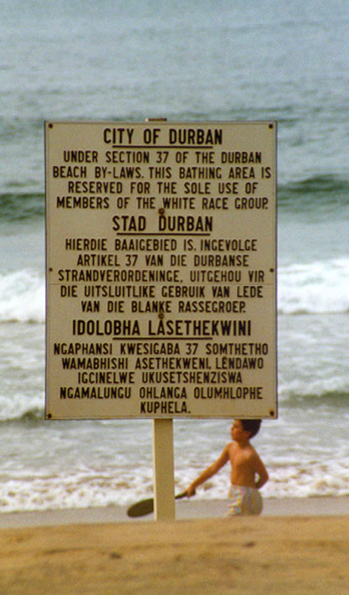

# 아르파트헤이트(Apartheid)

# 개요

아프리칸스어로 분리, 격리를 뜻한다. 영어로는 아파타이트(/əˈpɑːrt(h)aɪt/ ə-PART-(h)yte)라고 발음한다.
냉전 시기부터 남아공 국민당(National Party) 정권이 실시한 인종차별 정책이다.

백인과 흑인의 격리는 차별과는 별개의 문제라는 논리로 시작했지만 근본은 차별에 기인한다. 말만 격리지 유색인을 위한 시설은 백인의 것들보다 항상 열악했다. 이 정책은 1960년대부터 1980년대까지 이어졌고, 이로 인해 국제사회로부터 철저히 배척받았다.  

앙골라 내전(1975년) 당시 미국과 중국이 비난 받았던 이유는 `침공`이나 `대학살`이 아닌 `남아공과의 협력` 자체였다. 물론 앙골라 해방인민운동 뒤에 있는 소련에 대한 대리전으로서 참전한 것이지만.  