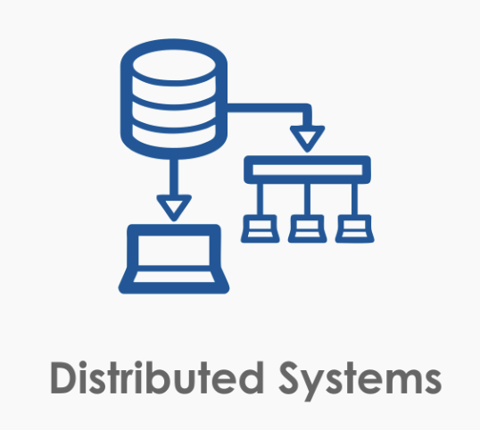

# 분산 시스템

> A distributed system is one in which the failure of a computer you didn’t even know existed can render your own computer unusable.  
> 
> Leslie Lamport

레슬리 람포트의 혜안..

# 개요

오늘날의 시스템은 대부분 분산 시스템이다. 우리 주변에서 가장 흔하게 찾아볼 수 있는 클라이언트-서버 모델을 사용하는 것들을 분산 시스템으로 볼 수도 있다. 쉬운 이해를 위해 덧붙이자면 여기서 클라이언트는 여러분 핸드폰에 설치된 앱에 해당되고, 앱의 요청은 보통 서버가 처리해준다.  

기존 시스템은 단일 노드의 컴퓨터에서 모든 것을 처리하는 것으로도 충분했었다. 서비스를 하더라도 단일 노드의 데이터베이스가 모든 것을 처리하고 성능, 용량의 문제가 발생하면 수직 확장(Vertical Scaling)으로 문제 해결이 가능했다. 하지만 무어의 법칙이 물리적 한계에 마주한 오늘날은 이야기가 다르다. 무어의 법칙의 한계는 곧 단일 머신의 한계가 생겼다는 뜻이다. 수직 확장은 물리적으로 하기도 힘들고, 하려고 하더라도 비용이 크다.  

이러한 한계를 극복하기 위해 값싼 노드를 네트워크를 통해 묶고 이를 하나의 논리적인 엔티티처럼 취급하는 것이 바로 분산 시스템의 골자이다. 그리고 이는 수평 확장(Scale Horizontally)에 해당한다.  

우리 회사는 규모가 작아서 분산 시스템 같은거 안쓰는데요? 그럴리가 없다. 적어도 API 서버와 데이터베이스는 분리하니까. 이미 시스템이 취급하는 관심사에 따라 분리가 되어 있고 네트워크를 통해서 통신한다. 서비스 DB에서 분석 쿼리 날리다가 서비스가 중단되는 멋진 일이 발생하면 read replica로 분리하는 선택을 하지 않는가? 그렇다. 이미 우리는 분산 시스템을 숨쉬듯 자연스럽게 사용하는 세상에서 살고 있다.  

분산 시스템에 대한 이론은 이미 충분히 오래전에 나온 것들이고 비교적 최근에 와서야 상용화를 통해 사용되기 시작했다. 그래? 이론 충분하네. 그냥 네트워크로 연결하면 되는거 아냐? 아니다. 고려해야할 것이 너무나도 많아진다. 그 내용을 정리해보자.  

# 기본 정의

분산 시스템은 기본적으로 `참여자`가 존재한다. 그리고 각각의 참여자는 고유한 지역적 상태(Local State)를 지니고 있다. 이들은 기본적으로 네트워크를 통해서 연결되어 있고 메세지를 교환하는 방식으로 커뮤니케이션을 한다.  

여기서부터 고통은 시작된다.  

* 먼저 메세지를 보낸 노드가 있지만 모종의 이유로 지연되어 늦게 도착했다.  
* 어떤 노드가 잘못되었다는 사실은 무엇을 근거로 해야할까? 사실은 내 시스템의 문제일 수도 있는데?
* 리더였던 나. GC로 Stop The World를 얻어 맞고 정신을 차려보니 나는 제외되어 있고 리더는 변경되어 있다. 하지만 나도 리더인걸? -> Split Brain