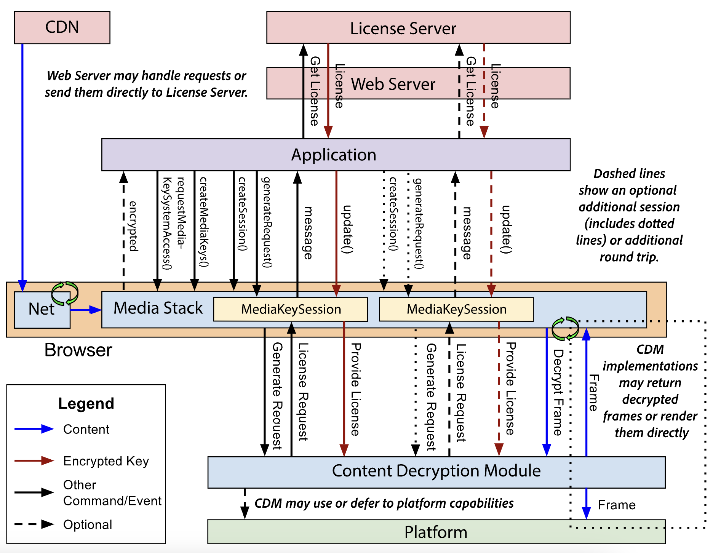

# Encrypted Media Extensions

EME는 웹 브라우저와 DRM(Digital Rights Management)을 구현하는 CDM(Content Decryption Module)간의 통신 채널 제공을 하기 위한 W3C의 명세

넷플릭스를 캡쳐해도 검은색 이미지만 나오는 이유!

[EME Draft 문서](https://w3c.github.io/encrypted-media/)

