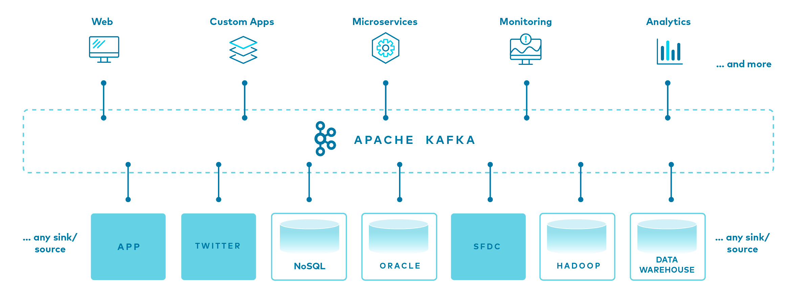

# 제목1

> 인용문 예시입니다.

다음은 코드 블록입니다.

```python
def hello():
    print("hello world")
```

코틀린 코드블록

```kotlin
fun hello() {
    println("hello world")
}
```

그냥 일반적인 문장이시다. 그냥 일반적인 문장이시다. 그냥 일반적인 문장이시다.그냥 일반적인 문장이시다. 그냥 일반적인 문장이시다. 그냥 일반적인 문장이시다.그냥 일반적인 문장이시다. 그냥 일반적인 문장이시다. 그냥 일반적인 문장이시다.그냥 일반적인 문장이시다. 그냥 일반적인 문장이시다. 그냥 일반적인 문장이시다.그냥 일반적인 문장이시다. 그냥 일반적인 문장이시다. 그냥 일반적인 문장이시다.그냥 일반적인 문장이시다. 그냥 일반적인 문장이시다. 그냥 일반적인 문장이시다.그냥 일반적인 문장이시다. 그냥 일반적인 문장이시다. 그냥 일반적인 문장이시다.

개행을 테스트한다.

[외부 링크](https://wiki.chiho.one)는 이렇게 표시될 예정이다.

이미지는 다음과 같이 표시될 예정이시다.



## 제목2
### 제목3
#### 제목4
##### 제목5
###### 제목6