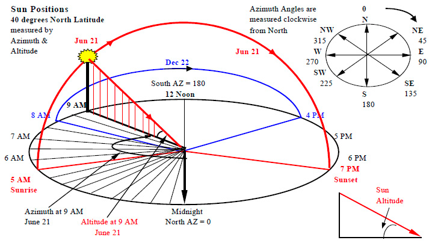

# 개요

계절 변화의 요인. 계절 변화는 태양과 지구의 거리로 인한 것이 아니다. 지구의 자전축이 기울어져 있기 때문이다. 지구의 자전축은 23.5도 기울어져 있다. 이 자전축이 기울어져 있기 때문에 태양의 직사광선이 지구의
표면에 도달하는 각도가 변하게 된다. 이 각도가 변함에 따라 태양의 직사광선이 도달하는 지역이 변하게 되고, 이에 따라 계절이 변하게 된다.

여기서 또 한 가지 알아두어야 할 사실은 지구가 태양을 공전한다는 것이다. 따라서 공전으로 인한 태양의 위치와 지구의 자전축을 생각해보면 간단하다.  

이로 인해 낮과 밤의 길이가 계절에 따라서 달라진다.  