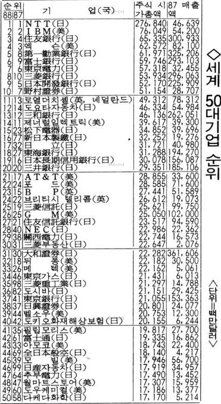

# 개요

1985년 9월 22일 미국, 일본, 영국, 프랑스, 서독의 재무장관들이 뉴욕 맨해튼의 플라자 호텔에서 진행한 환율 조정 합의.
미국이 인위적으로 달러의 가치를 떨어뜨리기 위해 다른 나라 화폐의 가치를 올리도록 했다.

1980년대 초 일본은 수출 대부분이 미국에 의존하고 있었다. 따라서 이런 요구에 따를 수 밖에 없었다. 이 여파로 일본의 잃어버린 10n년이라는 초장기 불황 현상이 발생했다. 엔화의 가치가 높아졌기 때문에 무역에서 손해를 보기 시작했다.

# 배경

1970년대 중동 산유국들이 담합해서 석유 가격을 올렸다. 담합으로 감산하면 대체제가 없기 때문에 유가가 엄청나게 뛰었다. 
유가가 오르면 자연스럽게 물건을 만들고 운반하는데 들어가는 비용이 증가한다. 재료값이 올라가기 때문에 인플레이션이 따라오게 되었다. 
인플레이션을 잡기 위해 연준(폴 볼커)이 금리를 올려버린다. 금리가 올라가면 대출이 줄어들고(이자 갚기가 빡세지므로) 저축이 늘어난다. 시중에 풀려있는 돈이 줄어들어 돈의 가치는 올라가고 물견 가격은 떨어진다. 소비를 안하니 경기가 침체된다.
미국의 제조업이 박살이 난다. 미국이 기준금리를 올려 달러가 미국으로 몰려오고 환율이 올라가게 된다. 
이 반사이익을 얻는 곳이 일본이었다. 같은 물건을 팔아도 환율에 따라 가치가 달라지기 때문이다. 일본은 미국을 상대로 엄청난 무역흑자를 냈다. 이는 미국의 무역적자를 의미한다.

이런 이유로 미국은 G5 재무장관들을 모아 환율 조정을 진행하게 되었다.

1980년대 세계의 기업 순위

20위 내의 기업 17개가 모두 일본이다.  

# 여파

각국의 화폐 가치는 상승하고 반대로 미국은 2년간 30% 이상 급락한다. 달러의 약세는 미국 제조업의 회복과 무역적자 감소로 이어졌다.
수출이 노답이되자 일본 정부는 내수를 살리기 위해 시중에 돈을 푼다. 기준 금리를 내리고 부동산 규제를 풀었다. 낮은 금리로 인해 대출이 쉬워지고 부동산이 과열된다. 수요가 늘어난 부동산은 가격이 치솟게 된다. 거품이 생기기 시작한 것이다. 
이 것이 일본의 버블경제로 이어지고 89년에 고점을 찍었던 닛케이 지수는 현재까지도 회복을 못하고 있다. 그 외에도 일본은 여러 악재들로 인해 회복의 타이밍을 계속 잡지 못하게 된다.

